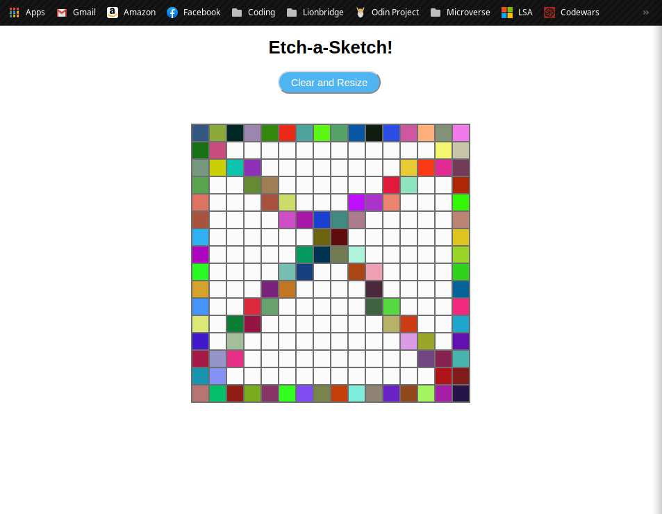
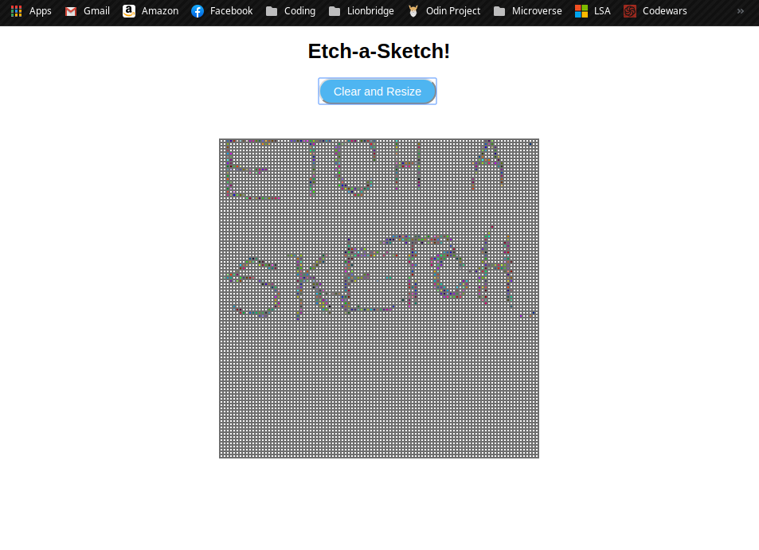

# Etch a Sketch

> Fun canvas to draw with your mouse!

This project is a fun website to draw in a canvas using your mouse. Every time you pass over a cell it will, randomly, color itself! Set up your canvas of up to 100 x 100 cells!

## Usage example

This is a fun relaxing webapp to just color your way out of stress and have some fun!

## Built With

- HTML
- CSS
- Javascript

## Live Demo

[Live Demo Link](https://rawcdn.githack.com/lmaldonadoch/etch-a-sketch/0a4ea2a878962f780bec829049f179c54578512b/index.html)

## Getting Started

**Need web browser.**

To get a local copy up and running follow these simple example steps.

### Download Repository (https://github.com/lmaldonadoch/etch-a-sketch)

## Author

👤 **Luis Angel Maldonado**

- Github: [@lmaldonadoch](https://github.com/lmaldonadoch)

## 🤝 Contributing

Contributions, issues and feature requests are welcome!

Feel free to check the [issues page](https://github.com/lmaldonadoch/pomodoro-clock/issues).

## Show your support

Give a ⭐️ if you like this project!

## Acknowledgments

- This project is based in a project by [The Oddin Project](https://www.theodinproject.com)
